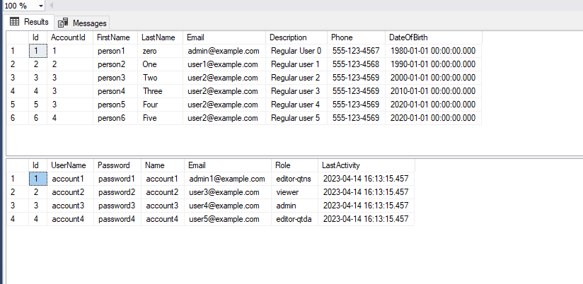

# Patika Ford Otosan Bootcamp HW-02 NICEAPI


## Data Tables 




## API Reference for Account

#### GetAll()

```http
  GET patika/hw01/NiceAPI/Account
```

| Parameter | Type     | Description                |
| :-------- | :------- | :------------------------- |
| `no parameter` | | **Required**. Authorization |

>Shows all account infos

#### GetUserDetail()

```http
  GET /patika/hw01/NiceAPI/Account/GetUserDetail
```

| Parameter | Type     | Description                       |
| :-------- | :------- | :-------------------------------- |
| `no parameter`      |  | **Required**. Id of item to fetch |

> Shows infos which is belong to the Authorized account


#### POST()

```http
  POST patika/hw01/NiceAPI/Account
```

| Parameter | Type     | Description                |
| :-------- | :------- | :------------------------- |
| `Request` | `AccountDTO`  | **Required**. Authorization & Roles = Role.Admin|

> If Authorized account is "admin", then it can post new Account infos.

#### PUT()

```http
  PUT patika/hw01/NiceAPI/Account/{id}
```

| Parameter | Type     | Description                |
| :-------- | :------- | :------------------------- |
| `id, Request` | `AccountDTO`  | **Required**. Authorization & Roles = Role.Admin|

> If Authorized account is "admin", then it can update every Account infos.

#### PUT()
```http
  Put patika/hw01/NiceAPI/Account
```

| Parameter | Type     | Description                |
| :-------- | :------- | :------------------------- |
| `Request` | `AccountDTO`  | **Required**. Authorization & Roles = RolesExceptAdmin|

> If Authorized account is **NOT** "admin", then it can update only its own infos.

#### DELETE()
```http
  DELETE patika/hw01/NiceAPI/Account/{id}
```

| Parameter | Type     | Description                |
| :-------- | :------- | :------------------------- |
| `id` | `int`  | **Required**. Authorization & Roles = Role.Admin|

> If Authorized account is "admin", then it can delete every Account infos.

#### DELETE()
```http
  Put patika/hw01/NiceAPI/Account
```

| Parameter | Type     | Description                |
| :-------- | :------- | :------------------------- |
| `no parameter` |   | **Required**. Authorization & Roles = RolesExceptAdmin|

> If Authorized account is **NOT** "admin", then it can delete only its own infos.

## API Reference for Person

#### GetAll()

```http
  GET /patika/hw01/NiceAPI/Person
```

| Parameter | Type     | Description                |
| :-------- | :------- | :------------------------- |
| `no parameter` | | **Required**. Authorization |

>Shows all person infos which belongs to Authorized account

#### GetById()

```http
  GET /patika/hw01/NiceAPI/Person/{id}
```

| Parameter | Type     | Description                       |
| :-------- | :------- | :-------------------------------- |
| `id`      | `int`  | **Required**. Id of item to fetch |

> Shows person infos if Authorized account has a access to see that person. 
> In this endpoint, admin has not have advantage. It can be modified.


#### POST()

```http
  POST patika/hw01/NiceAPI/Account
```

| Parameter | Type     | Description                |
| :-------- | :------- | :------------------------- |
| `Request` | `PersonDTO`  | **Required**. Authorization|

> Post new person infos to the your Authorized account. 
> That means **accountId** of the new person cames from Authorized account's id.
> If the role is admin, it can post new person any account.

#### PUT()

```http
  PUT patika/hw01/NiceAPI/Account/{id}
```

| Parameter | Type     | Description                |
| :-------- | :------- | :------------------------- |
| `id, Request` | `PersonDTO`  | **Required**. Authorization|

> If Authorized account is "admin", then it can update every Account infos.
> OR if your account's id is the same as person's accountId, then you can update it.


#### DELETE()
```http
  DELETE patika/hw01/NiceAPI/Account/{id}
```

| Parameter | Type     | Description                |
| :-------- | :------- | :------------------------- |
| `id, Request` | `PersonDTO`  | **Required**. Authorization|

> If Authorized account is "admin", then it can delete every Account infos.
> OR if your account's id is the same as person's accountId, then you can delete it.